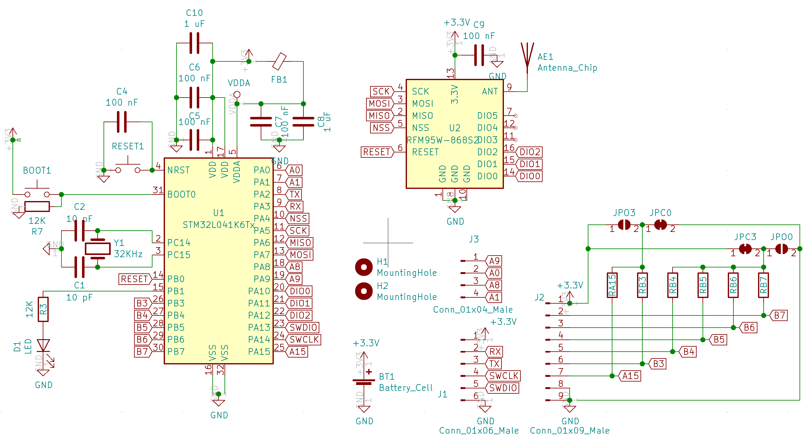

# Generic Sensor PCB

This device exposed all available GPIOs from the 32 pin STM32 so external sensors can be attached. Multiple use cases are listed bellow.

TBD picture overview installed

## Versions of the PCB

### Generic Sensor v1

This is the first version without any unneded HW. It is optimised to make it easy to esamble with only the programing pins and the battery holder not being SMD components. It does not external pull-ups so it relays into the internal ones in the MCU -> this is not the best for battery life (40 KOhms drag ca 75 uA) so v2 was develop to allow use larger (such as 10 MOhms) instead.

Since v2 is backwards compatible there is no need to use v1 anymore.

- [Aisler PCB project](https://aisler.net/p/YFVFQBHD)
- [SoilSensor.sch](KiCad/GenericSensor_v1.sch)
  - 
- [SoilSensor.kicad_pcb](KiCad/GenericSensor_v1.kicad_pcb)

### Generic Sensor v2

This verssion is backwards compatible (same posssitions for all components, even the v1 stencil might be used) but adds support for additional pull-ups or pull-downs. Check the schematic bellow to understand the options: there are two sets of solder jumpers that allow pull-up or pull-down selection. Also using 0R you can enable additional 3V and GND outputs.

- [Aisler PCB project](https://aisler.net/p/LVXPWPMZ)
- [SoilSensor.sch](KiCad/GenericSensor_v2.sch)
  - 
- [SoilSensor.kicad_pcb](KiCad/GenericSensor_v2.kicad_pcb)

## Use Cases

## Basic v1

This is mainly for debugging and as base for the other use cases. It is just the generic sensor and its embedded battery and temperature sensors.
- Sensor: none extra, just battery voltage and temperature
- Power consumption:
  - measurements: 0,4 mA, 30 ms, 1 measurement/minute
  - transmission: 120 mA, 50 ms, sending once/hour
  - iddle: 300 uA, 2 s, sending once/hour
  - deep sleep: 2 uA
  - battery: 1400 mAh
  - theoretical batery live (no auto-discharge): 39 years
- PINs: none of the external pins used
- Firmware:
  For programming either use the platformio UI or any of the following CLI commands:
  - `pio run -t upload -e generic_basic_v1` - PCB v2, STM32 L4
  - `pio run -t upload -e generic_basic_v1_debug` - PCB v2, STM32 L4, debug
- [3D Printed cage](cages):
  - None
- BUGS:
  - None so far

### Distance Sensor v1

Used to detect when a car is parked in a parking lot.

- Sensor:
  - Lidar [vl53l1x](https://www.st.com/en/imaging-and-photonics-solutions/vl53l1x.html): consumption small enough to be powered through a PIN without a mosfet - not low power enough to keep power during deep sleep. It can measure up to 4 meters.
    - Used [Melopero board](https://www.melopero.com/shop/sensori/prossimita/melopero-vl53l1x-time-of-flight-long-distance-ranging-sensor-breakout/) since it was quickly available in Amazon
    - Ordered some with cover from [China](https://de.aliexpress.com/item/4000110308676.html)
- Power consumption:
  - measurements: 1,5 mA, 120 ms, 1 measurement/minute
  - transmission: 120 mA, 50 ms, sending once/hour
  - iddle: 300 uA, 2 s, sending once/hour
  - deep sleep: 2 uA
  - battery: 1400 mAh
  - theoretical batery live (no auto-discharge): 23 years
- PINs:
  - PB7 -> vl53l1x I2C SDA
  - PB6 -> vl53l1x I2C SCL
  - PB5 -> vl53l1x VIN
  - GND -> vl53l1x GND
- Firmware:
  For programming either use the platformio UI or any of the following CLI commands:
  - `pio run -t upload -e distance_v1` - PCB v2, STM32 L4
  - `pio run -t upload -e distance_v1_debug` - PCB v2, STM32 L4, debug
- [3D Printed cage](cages/distance):
  - 
- BUGS:
  - None so far
  
### Door Sensor v1

This sensor tracks the state (open/closed) of up to 4 doors or windows. It supports two modes:
- simple: the state of the door/window is directly reported as soon as it changes
- perssistent mode (or post-mode): once the door is opened once is reported as open even if it gets closed afterwards. A second sensor is used to reset the reported door status back to closed. The reset is typically associated to a second door used to pick up the post but it could also get connected to a button that plays the same role.

- Sensor:
  - 1-8 x [Reed Contact N/O Magnetic Induction Switch](https://www.amazon.de/gp/product/B07SZDGXLC): this switch reports open so far no magnet is close. This would correspond to the door/window being open.
  - 1-8 x Circular magnet
  - 1-8 x 10 MOhms resistor
- Power consumption:
  - measurements: 1,5 mA, 40 ms, 2 measurement/day (post mode)
  - transmission: 120 mA, 50 ms, sending 2/day
  - iddle: 300 uA, 2 s, sending once/hour
  - deep sleep: 2 uA + (0.3 * number_of_sensors)
  - battery: 300 mAh
  - theoretical batery live (no auto-discharge): 23 years
- PINs (using PCB v1): each sensor needs a big (10 MOhm resistor) pull-up
  - VCC  -> pull-up resistors
  - PB7  -> pull-up resistor and door 1 reed switch
  - PB6  -> pull-up resistor and door 1 reset reed switch
  - PB5  -> pull-up resistor and door 2 reed switch (need to uncomment in `platformio.ini`)
  - PB4  -> pull-up resistor and door 2 reset reed switch (need to uncomment in `platformio.ini`)
  - PB3  -> pull-up resistor and door 3 reed switch (need to uncomment in `platformio.ini`)
  - PA15 -> pull-up resistor and door 4 reset reed switch (need to uncomment in `platformio.ini`)
  - PA0  -> pull-up resistor and door 4 reed switch (need to uncomment in `platformio.ini`)
  - PA4  -> pull-up resistor and door 4 reset reed switch (need to uncomment in `platformio.ini`)
  - GND -> reed switches
- PINs (using PCB v2) for 2 doors:
  - VCC: not used
  - RB7, RB6, RB5, RB4: 10 MOhms (0805 type)
  - RB3, RA15: 0R (0805 type)
  - Solder jumpers umodified
  - PB7  -> door 1 reed switch
  - PB6  -> reset for door 1 (or door 3) reed switch
  - PB5  -> door 2 reed switch
  - PB4  -> reset for door 2 (or door 4) reed switch
  - PB3, PA15 and both GNDs: any of the above reed switches
- Firmware:
  For programming either use the platformio UI or any of the following CLI commands:
  - `pio run -t upload -e distance_v1` - PCB v2, STM32 L4
  - `pio run -t upload -e distance_v1_debug` - PCB v2, STM32 L4, debug
- [3D Printed cage](cages/door):
  - 
- BUGS:
  - None so far