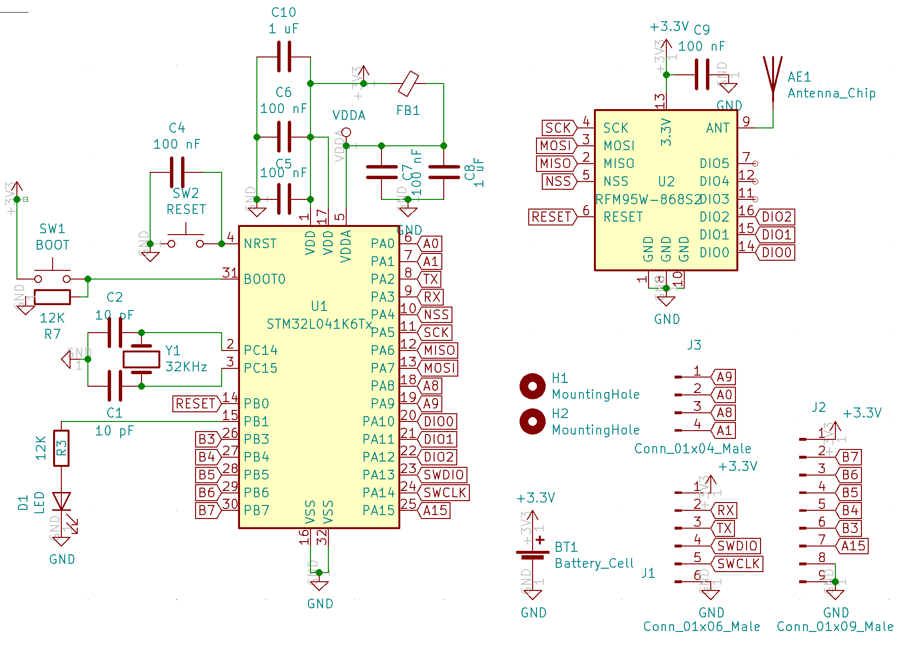

# Generic Sensor PCB

This device exposed all available GPIOs from the 32 pin STM32 so external sensors can be attached. Multiple use cases are listed bellow.

TBD picture overview installed

## Versions of the PCB

### Generic Sensor v1

This is the (currently) final version without any unneded HW. It is optimised to make it easy to esamble with only the programing pins and the battery holder not being SMD components.

TBD overview picture painted

- [Aisler PCB project](https://aisler.net/p/YFVFQBHD)
- [SoilSensor.sch](KiCad/GenericSensor_v1.sch)
  - 
- [SoilSensor.kicad_pcb](KiCad/GenericSensor_v1.kicad_pcb)
  - 

## Use Cases

### Distance Sensor

Used to detect when a car is parked in a parking lot.

- Sensor:
  - Lidar [vl53l1x](https://www.st.com/en/imaging-and-photonics-solutions/vl53l1x.html): consumption small enough to be powered through a PIN without a mosfet - not low power enough to keep power during deep sleep. It can measure up to 4 meters.
    - Used [Melopero board](https://www.melopero.com/shop/sensori/prossimita/melopero-vl53l1x-time-of-flight-long-distance-ranging-sensor-breakout/) since it was quickly available in Amazon
    - Ordered some with cover from [China](https://www.ebay.de/itm/Laser-4M-50Hz-VL53L1X-I2C-Flight-Time-ToF-Ranging-Sensor-w-Optical-Cover)
- Power consumption:
  - measurements: 1,5 mA, 120 ms, 1 measurement/minute
  - transmission: 120 mA, 50 ms, sending once/hour
  - iddle: 300 uA, 2 s, sending once/hour
  - deep sleep: 2 uA
  - battery: 1400 mAh
  - theoretical batery live (no auto-discharge): 23 years
- PINs:
  - PB7 -> vl53l1x I2C SDA
  - PB6 -> vl53l1x I2C SCL
  - PB5 -> vl53l1x VIN
  - GND -> vl53l1x GND
- Firmware:
  For programming either use the platformio UI or any of the following CLI commands:
  - `pio run -t upload -e distance_v1` - PCB v2, STM32 L4
  - `pio run -t upload -e distance_v1_debug` - PCB v2, STM32 L4, debug
- [3D Printed cage](cages):
  - 
- BUGS:
  - None so far