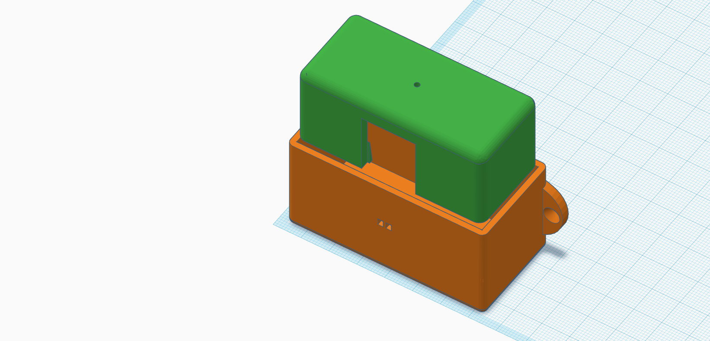

# Box for distance sensor
There are 2 files for each sensor, box and cover.

## Options used for printing
- Layer height __0.2 mm__
- Nozzle diameter __0.4 mm__
- Material __PETG__

## Mount indications

You would need 4mm long M4 screws, although it is not entirely necessary because the board is very well fitted in the box. An extra M2 screw is needed to mount a handle under the PCB, to make easier removing the box from the cover. The cover is fixed to the wall with 3mm screws. It is also recommended to apply some protection to the cover of the box to better withstand  outside, it is better that it ends up having a light or reflective color to prevent it from heating up in sunlight.
