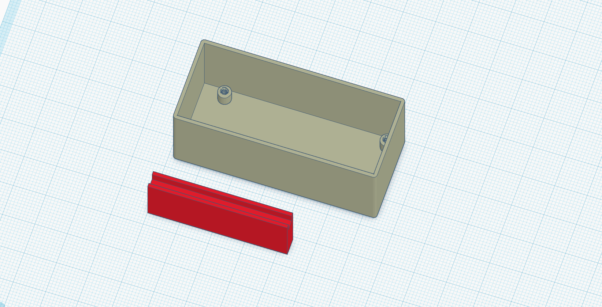

# Box for door Sensor
There are 2 files for each sensor, box and [reed switch](https://www.explainthatstuff.com/howreedswitcheswork.html) holder.

- [Box preview](https://a360.co/3GygWqv)
- [Fusion 360 model](Lora-generic-box.f3z)
- 

## Options used for printing
- Layer height __0.2 mm__
- Nozzle diameter __0.4 mm__
- Material __PETG__

## Mount indications

You will need 2x 6mm long M2 screws. Use double-sided tape to secure the box, the reed switch holder, and the magnets.