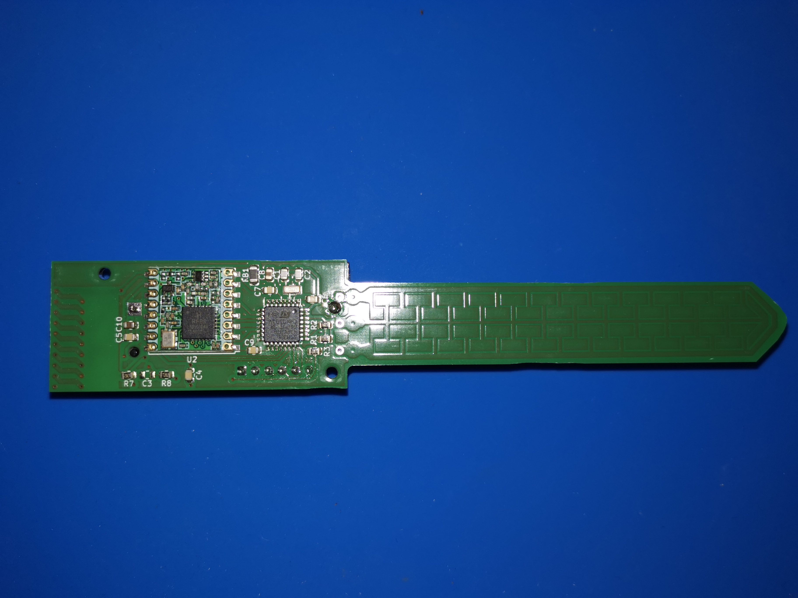
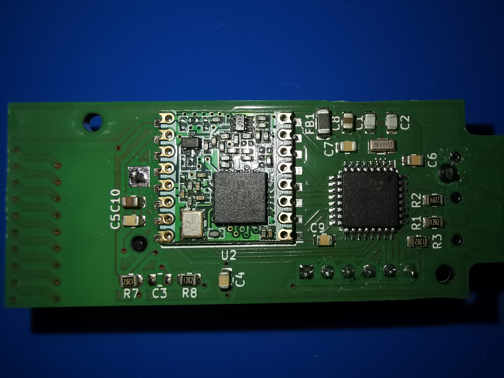
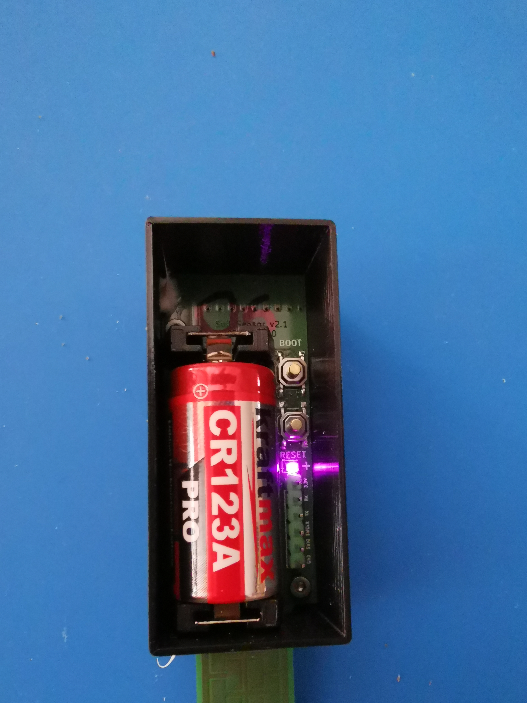
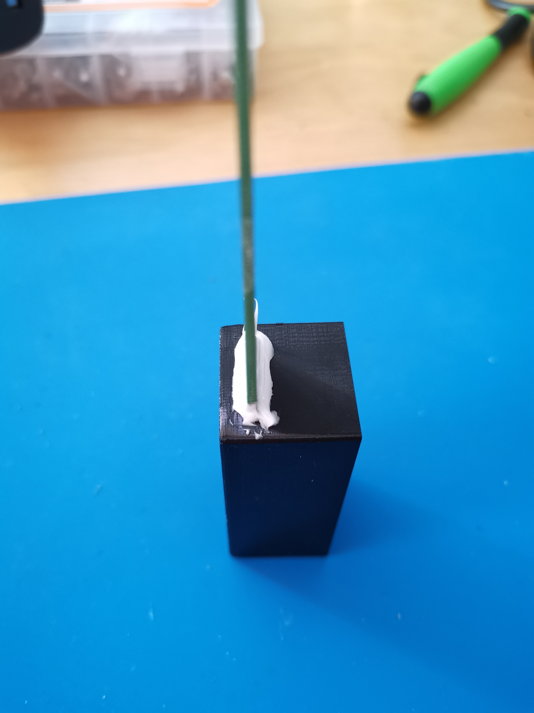
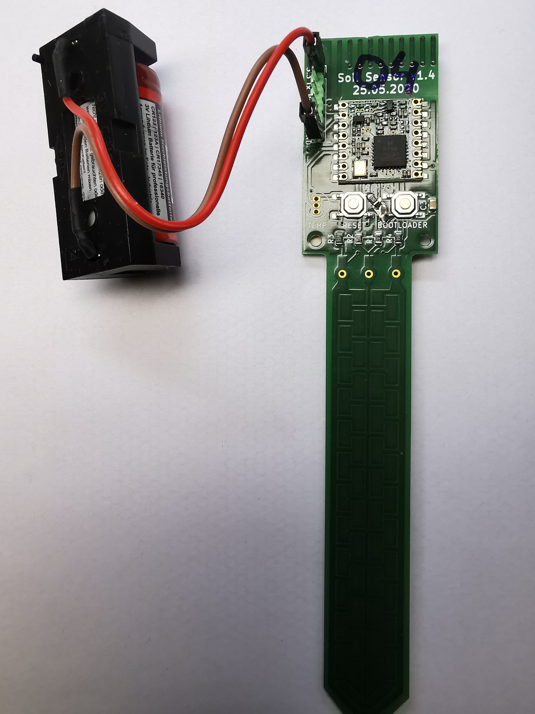
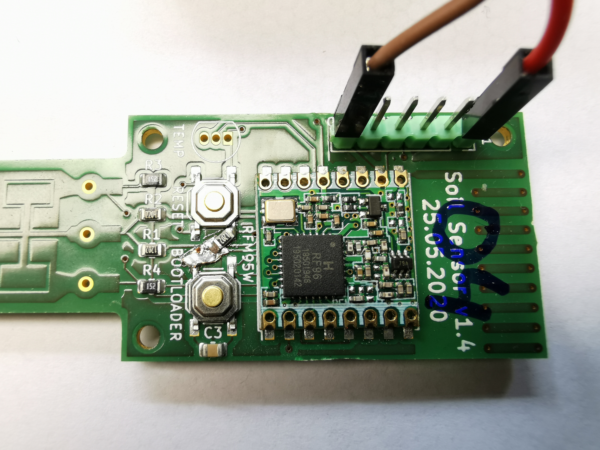
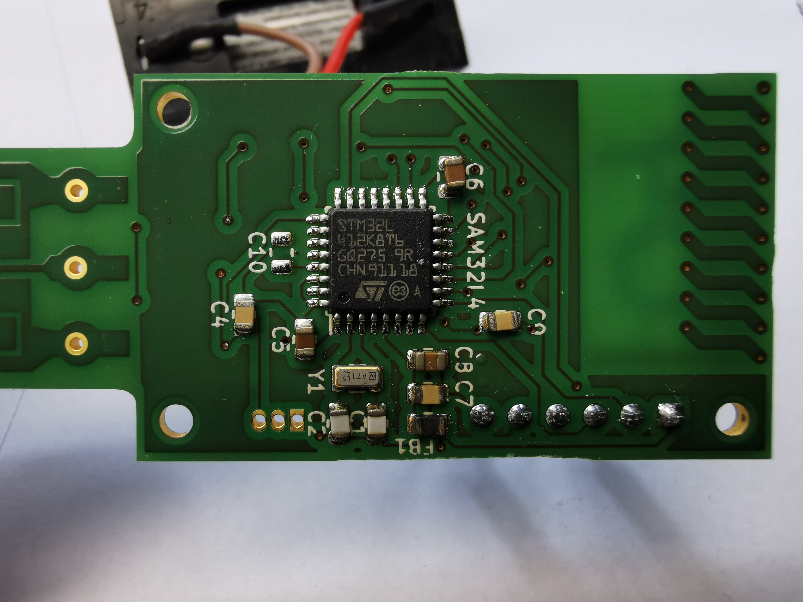
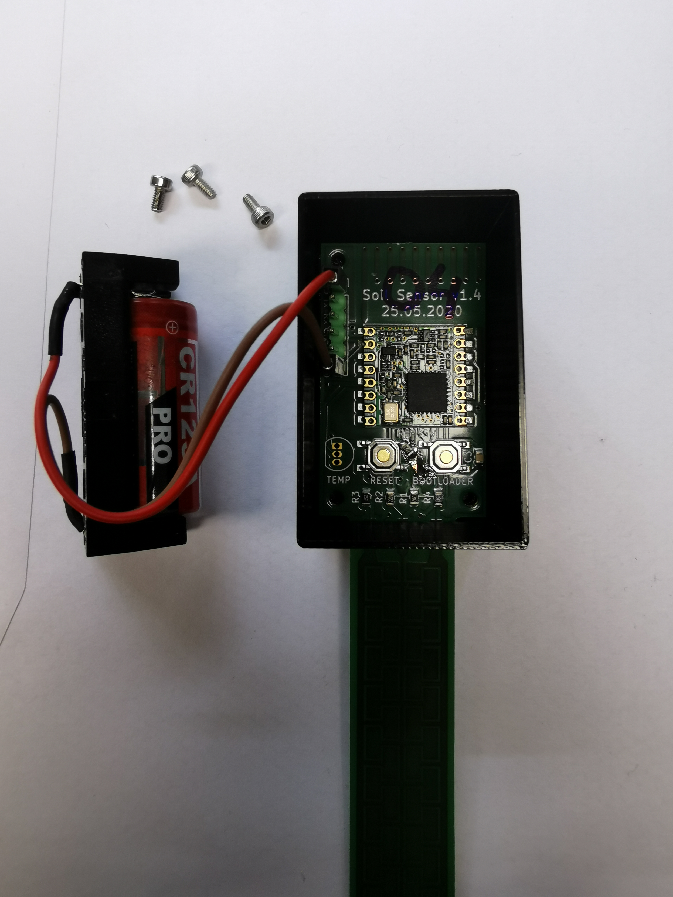
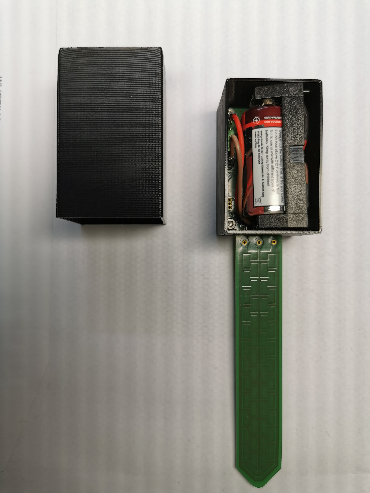

# Capacitive Soil Sensor

This device includes a capacitive sonde in the same PCB. The resulting device can measure the soil moisture without beeing corroded nor being affected by the temperature as the resistive soil sensors.

TBD picture overview installed

## Power cosumption

- sleep: 1.5 uA
- run: 415 uA at 4 MHz - 20 ms for measurement - 2 seconds waiting for reception
- Sending; 120 mA during 50 ms
- Sending each 60 minutes (at least moisture level changess fast - watering, raining)
- Battery: 1400 mAh
  
The above gives a theorical batery life of 47 years without auto-discharge. In reality the auto-discharge effect is expected to be the predominant one defining the live of the device to around 20 years for a good quality battery.

## References

- Moisture sensors
  - https://hackaday.io/project/161994-mesh-network-soil-moisture-sensor
  - https://flashgamer.com/blog/comments/testing-capacitive-soil-moisture-sensors
  - https://www.thethingsnetwork.org/labs/story/a-cheap-stm32-arduino-node
- Touch sensors
  - using two pins: https://github.com/PaulStoffregen/CapacitiveSensor
    - this is what it used here
  - STM32 - https://github.com/arpruss/ADCTouchSensor
    - based on https://github.com/martin2250/ADCTouch

## Versions

### Soil Sensor v2

This is the (currently) final version without any unneded HW. It is optimised to make it easy to esamble with only the programing pins and the battery holder not being SMD components.

TBD overview picture painted

- [Aisler PCB project](https://aisler.net/p/DFIQTREA)
- [SoilSensor.sch](KiCad/SoilSensor_v2.sch)
  - 
- [SoilSensor.kicad_pcb](KiCad/SoilSensor_v2.kicad_pcb)
  - 
  - 
  - [SVG for soil sonde](pictures/soilSonde.svg)
    - edited with [Inkscape](https://inkscape.org)
    - imported to KiCad with [svg2shenzhen](https://github.com/badgeek/svg2shenzhen) plugin.
    - 
- Firmware:
  For programming either use the platformio UI or any of the following CLI commands:
  - `pio run -t upload -e soilsensor_v2_L4` - PCB v2, STM32 L4
  - `pio run -t upload -e soilsensor_v1_L4` - PCB v1, STM32 L4
  - `pio run -t upload -e soilsensor_v1_L0` - PCB v1, STM32 L0
- [3D Printed cage](cage) sealed with silicone:
  - 
  - 
- BUGS:
  - C3 (the condensator for the BOOT selector) should have been connected to GND instead of VCC to avoid starting the bootloader first time we connect the battery. Not soldering it works fine so need for a new revision.

## Soil Sensor v1

This was the first version on STM32. It has multiple debug options so more complex than needed. Battery is connected with Dupont cables.

TBD overview picture painted

- [Aisler PCB project](https://aisler.net/p/FEKNZTQA)
- [SoilSensor.sch](KiCad/SoilSensor.sch)
  - 
- [SoilSensor.kicad_pcb](KiCad/SoilSensor.kicad_pcb)
  - 
  - 
  - 
  - [SVG for soil sonde](pictures/soilSonde.svg)
    - edited with [Inkscape](https://inkscape.org)
    - imported to KiCad with [svg2shenzhen](https://github.com/badgeek/svg2shenzhen) plugin.
    - 
- [3D Printed cage](cage) mount with battery:
  - 
  - 

- BUGS:
  - The boot input is missing a pull-up so sometimes the PCB boots into the bootloader after power-up. See [front picture](pictures/SoilSensor_v1_PCB_close_view_front.jpg) on how to manually add one.

## Soil Sensor v0

This was designed using [Fritzing](https://fab.fritzing.org/) and an Arduino pro mini. I only have a single instance running since the PCB had multiple bugs. Also the consumption was not so great since the used sensor required quite a lot of power to provide an stable read after waking up. Therefore it is not recommend to use this version.

- [Aisler PCB project](https://aisler.net/p/HJICOQLU)
- [Fritzing files](Fritzing-v0_only)
- BUGS: too many - very early prototype
