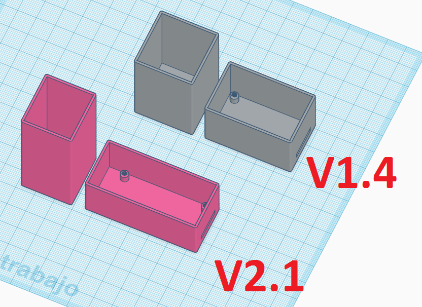

# Box for Sensor
There are 2 files for each sensor, box and cover. In the file name it is indicated for which board version each file is.

## Options used for printing
- Layer height __0.2 mm__
- Nozzle diameter __0.4 mm__
- Material __PETG__

## Mount indications

You would need 4mm long M2 screws, although it is not entirely necessary because the board is very well fitted in the box. It can be improved by sealing with silicone the part where the sensor comes out. It is also recommended to apply some protection to the cover of the box to better withstand  outside, it is better that it ends up having a light or reflective color to prevent it from heating up in sunlight.
