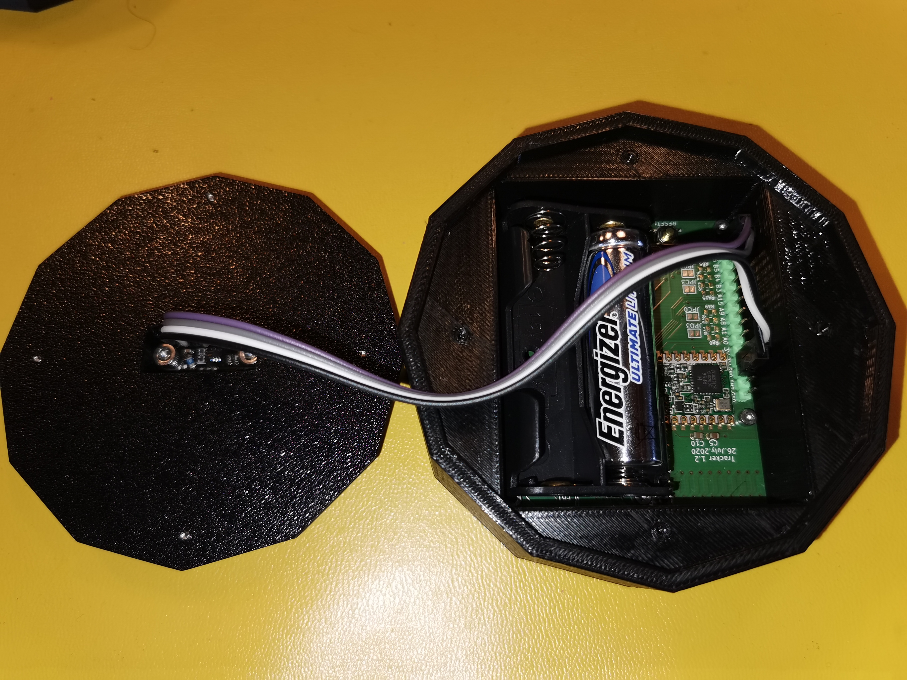
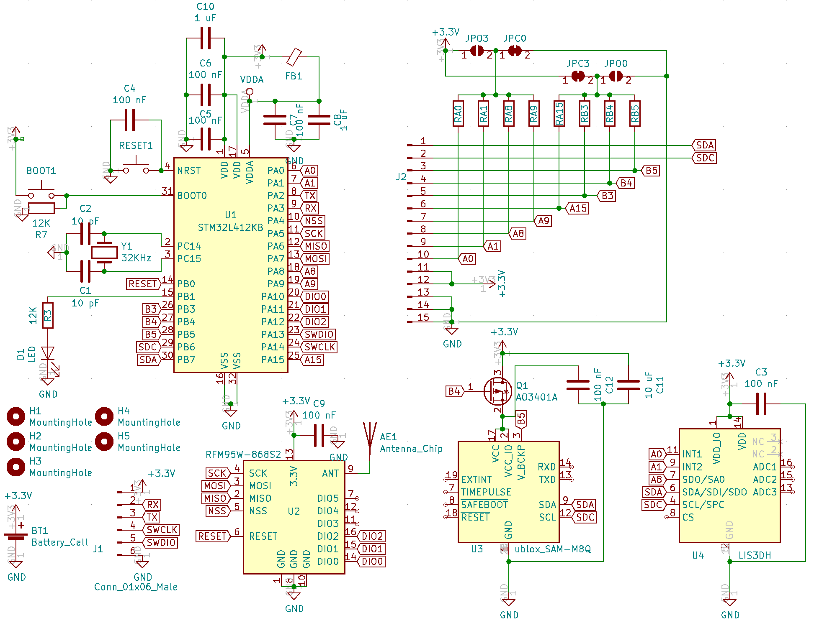
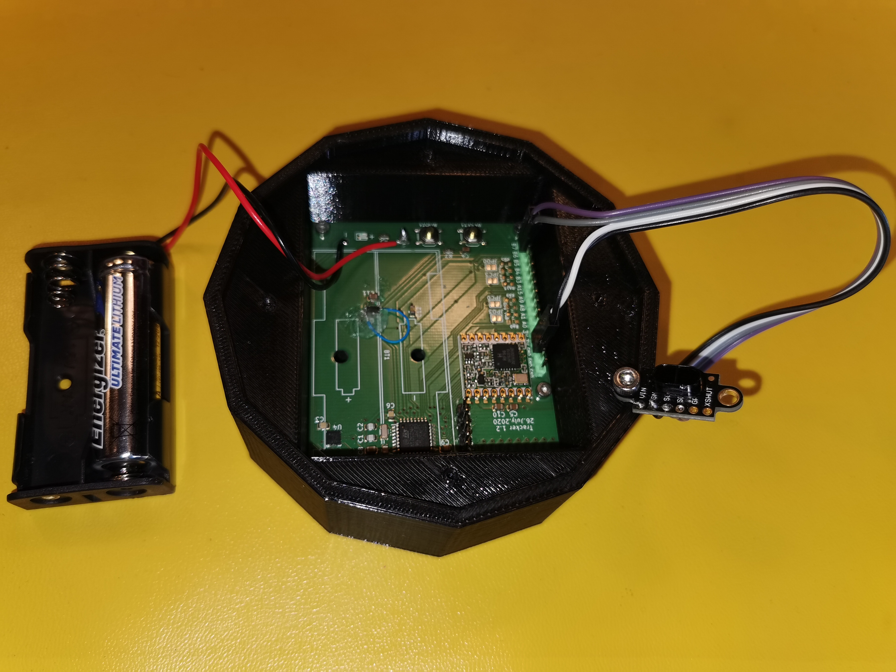
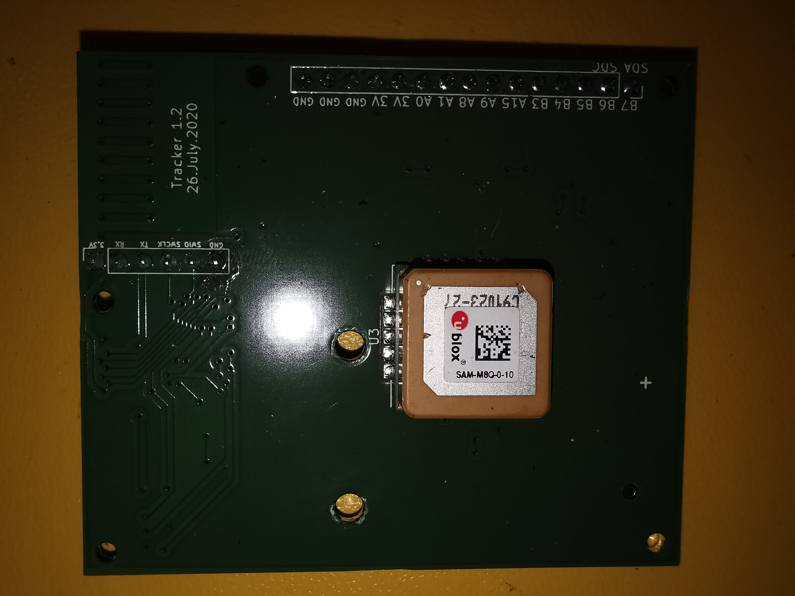
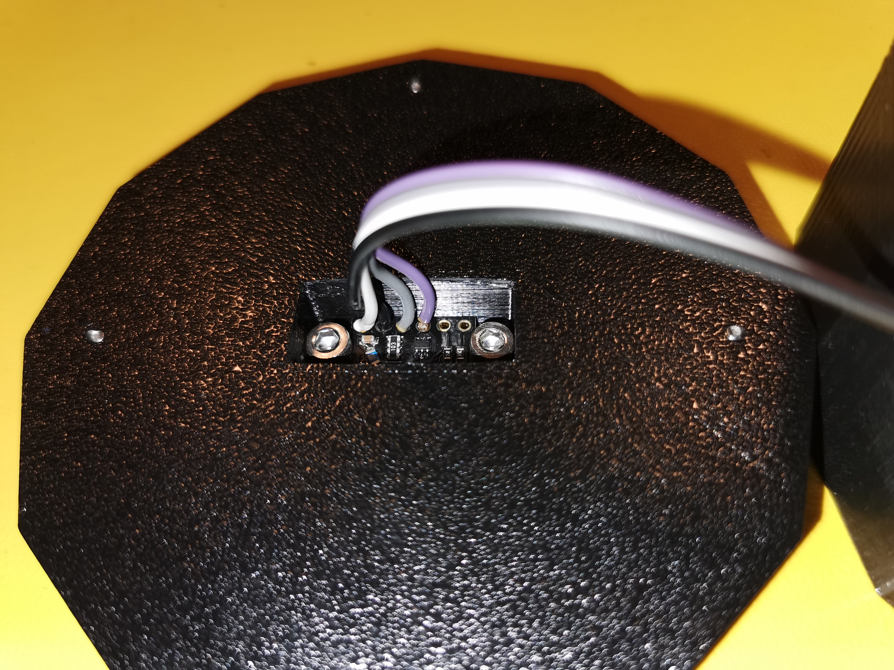
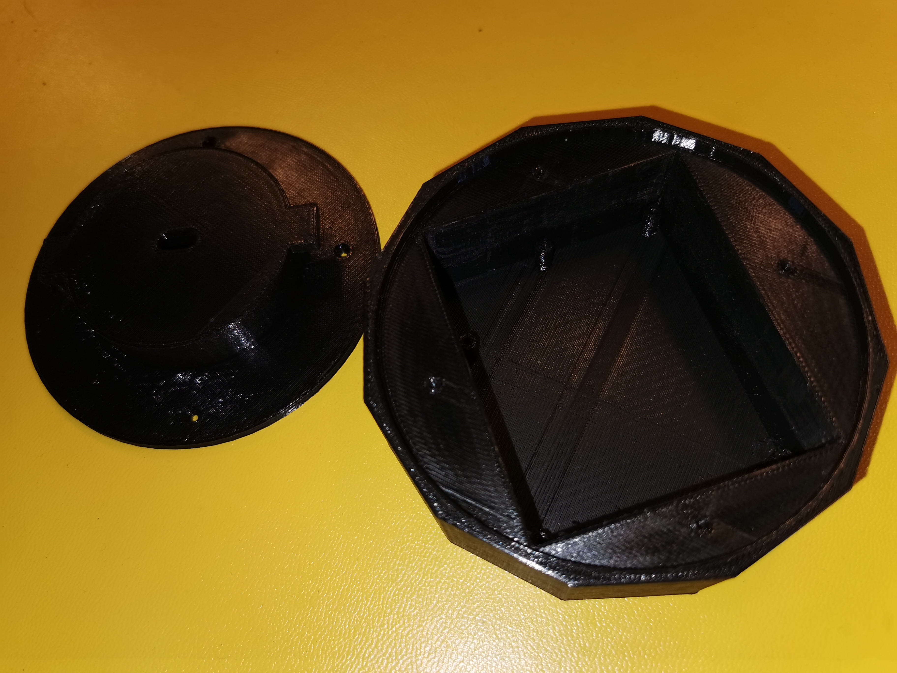
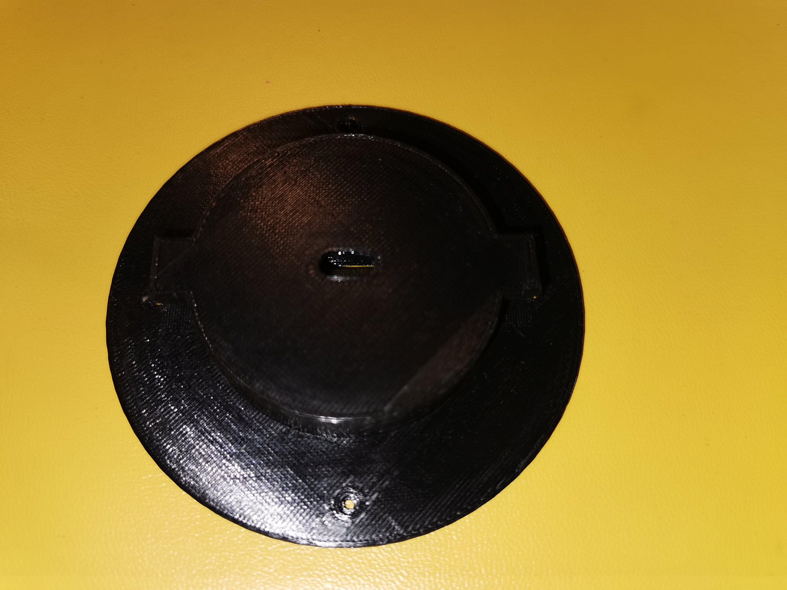

# Tracker

This is a GPS tracker including a move sensor and a distance sensor (not in the PCB). It also routes most of the MCU pins to a connector so additional sensors might be connected.

- 

## Tracker v1 (WIP)

In this version a distance sensor is also used to measure the gasoil level in a vehicle.

This is Work In Progress - Firmware not ready and PCB not tested yet.

- [Aisler PCB project](https://aisler.net/p/XNCQBQQY)
- [Tracker.sch](KiCad/tracker_v1.sch)
  - 
  - 
  - 
  - 
- [Traker.kicad_pcb](KiCad/tracker_v1.kicad_pcb)
- Sensor:
  - GPS [ublox_SAM-M8Q](https://www.u-blox.com/en/product/sam-m8q-module)
    - low-power: 15 uA to keep memory and clock - most important factor for battery life
    - very quick on hotfix - 1s
    - supports GPS, Galileo and Glonax
    - high sesitivity - after a fix I even get signal indoors
    - relatively expensive (20€)
  - Accelerometer [LIS3DH](https://www.st.com/en/mems-and-sensors/lis3dh.html)
    - ultra low-power so we can keep on and wake up GPS only when movement is detected
    - low cost (1,5€)
  - Lidar [vl53l1x](https://www.st.com/en/imaging-and-photonics-solutions/vl53l1x.html): consumption small enough to be powered through a PIN without a mosfet - not low power enough to keep power during deep sleep. It can measure up to 4 meters.
    - Ordered some with cover from [China](https://de.aliexpress.com/item/4000110308676.html)
    - Alternative: [Melopero board](https://www.melopero.com/shop/sensori/prossimita/melopero-vl53l1x-time-of-flight-long-distance-ranging-sensor-breakout/) more expensive but available in Amazon.
- Power consumption:
  - measurements: TBD, 1 measurement/day when not moving, 6 measurements per hour when moving
  - transmission: 120 mA, 50 ms, sending once/12 hours
  - iddle: 300 uA, 2 s, sending once/hour
  - deep sleep: 17 uA (mainly GPS)
  - battery: 3000 mAh
  - theoretical batery live (no auto-discharge): 19 years
- PINs:
  - PB7 -> vl53l1x I2C SDA
  - PB6 -> vl53l1x I2C SCL
  - PB3 -> vl53l1x VIN
  - GND -> vl53l1x GND
- Firmware:
  For programming either use the platformio UI or any of the following CLI commands:
  - `pio run -t upload -e tracker_v1` - PCB v2, STM32 L4
  - `pio run -t upload -e tracker_v1_debug` - PCB v2, STM32 L4, debug
- [3D Printed cage](cage):
  - 
  - 
  - 
  - 
  - 
- BUGS:
  - None so far
